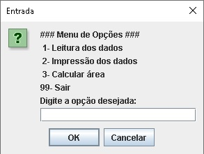

# Menu de opções com JOptionPane

Implementação de exemplo que utiliza JOptionPane do pacote swing para construir um menu de opções.

## Contextualização

 - Esta é uma versão do sistema para a IDE NetBeans.  
 - O projeto no NetBeans deve ser chamado **menusubmenujoptionpane**. 

## Menu principal

